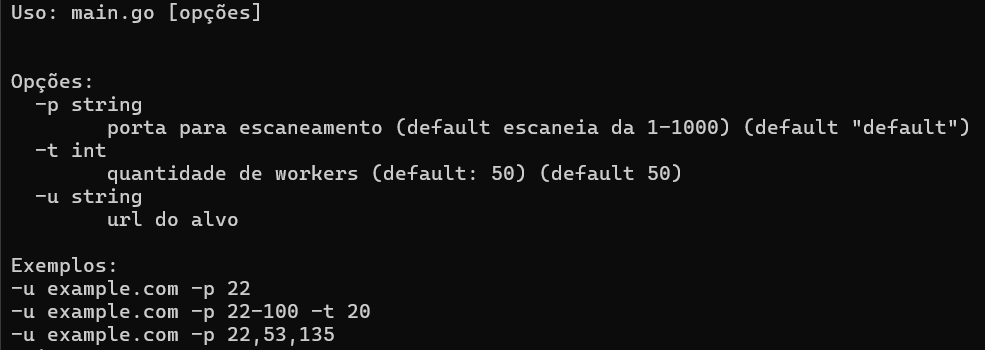
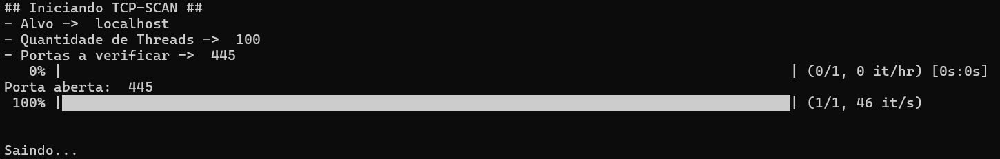
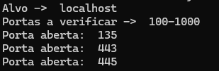
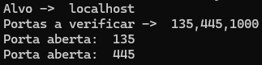
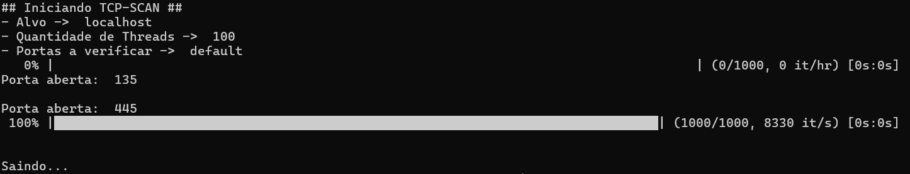

# Escaneamento de portas com Go

## Escopo
Um escaner de portas com possibilidade de compilação para diversos sistemas operacionais

## Instalação/Compilação
### Linux
```
GOOS="linux" GOARCH="amd64" go build main.go
```
### Windows
```
GOOS="windows" GOARCH="amd64" go build main.go
```
### MAC
```
GOOS="darwin" GOARCH="arm64" go build main.go
```
---

***Obs.:*** Caso queira outro tipo de compilação, dê o seguinte comando para mostrar as combinações

```
go tool dist list
```
---
## Utilização



Há quatro tipos de utilização:

*Obs.:* Os exemplos serão demonstrados sem compilação

### Porta única
```
go run main.go -u localhost -p 443
```
Resultado:



### Range de portas
```
go run main.go -u localhost -p 100-1000
```
Resultado:



### Portas específicas
```
go run main.go -u localhost -p 135,445,1000
```
Resultado:



### Modo default

O Modo Default utiliza por padrão a varredura das portas de 1 à 1000

```
go run main.go -u localhost
```
Resultado:




